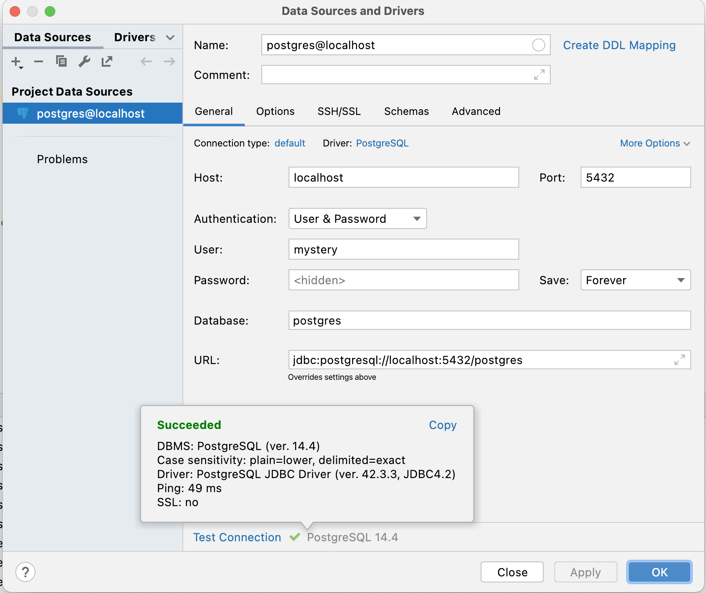

## CONFIGURE LOCAL POSTGRES DATABASE
### Problem statements
```bash
Postgres does not actual manage user/groups. It directly manage roles.
By default, the super user account has all privillege which include alter and delete database. 
Thus, by creating another roles and grant sufficient privillege is a better software practice.
```
### CREATE ROLE with psql

```sql
CREATE ROLE mystery WITH LOGIN PASSWORD 'root' ; 
```


### Grant user 'mystery' the creat DB privillige

```sql
 ALTER ROLE mystery CREATEDB; 
```


### Access lower privilege account
Quit the current shell
```sql 
\q
```
On terminal, access to lower privilege account
```sql
psql postgres -U mystery
```
You notice that the "#" has changed to "=>" which indicated that 
you are no longer a super user.

### CREATE DATABASE 'mystery'

```sql
CREATE DATABASE mystery;
```

### GRANT PRIVILEGES FOR USER 'mystery'
```sql
GRANT ALL PRIVILEGES ON DATABASE mystery TO mystery; 
```

### Connect DB to IntelliJ
Database => New => Datasource => PostgreSQL



### Congratulation!